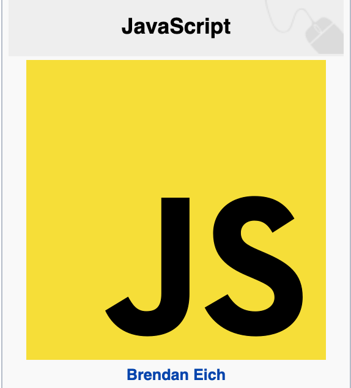

  
 

 
[Fuente: Wikipedia](https://es.wikipedia.org/wiki/JavaScript)

El siguiente texto esta inspirado de [MDN](https://developer.mozilla.org/es/docs/Web/JavaScript).

## ¿Qué es JavaScript?

Antes de comenzar aclaremos algo Java y JavaScript tienen semánticas y propósitos diferentes, **por 
lo cual no son lo mismo.**

  
 

 
Javascript comúnmente abreviado como JS, desarrollado por **Brendan Eich** de __Netscape__ inicialmente llamado como __Mocha__ el cual fue renombrado por __LiveScript__, para finalmente quedar como JavaScript, 
lanzado en diciembre de 1995.

Javascript es un lenguaje de **programación interpretado** y es **case-sensitive** (distingue mayúsculas y minúsculas), esto significa que la palabra **Fruta** no es igual a **fruta**.

JS es utilizado principalmente del **lado del cliente** (__client-side__),implementado como parte de un navegador web permitiendo hacer páginas web dinamicas, mejorando la interacción con el usuario; sin embargo JS también puede ser utilizado del **lado del servidor** (__Server-side JavaScript o SSJS__).

*Espera, ¿Qué es un lenguaje interpretado?*

En programación existen tipos de lenguajes, como el **interpretado** y el **compilado**.
Ambos son programas que convierten el código que escribes a *lenguaje de máquina*;
el lenguaje maquina son las instrucciones que entiende el computador en código binario (unos y ceros).

La principal diferencia son:

**Lenguaje interpretado**
Es convertido a *lenguaje de máquina* a medida que es ejecutado.

Ejemplos:
Ruby, Python y JavaScript, entre muchos otros.

**Ventajas**

- En el proceso del ciclo de desarrollo (el tiempo entre el momento en que escribes el código y lo pruebas) lo hace más rápido.

**Desventajas**
- Está optimizado para hacerle la vida más fácil al programador, aunque eso signifique una carga adicional para la máquina.

**Lenguaje Compilado**
Requiere un paso adicional antes de ser ejecutado, la compilación, esta convierte el código que escribes a lenguaje de máquina.

Ejemplos:
C, C++, Java, Go y Rust, entre muchos otros.

**Desventajas.**

- Es necesario realizar el proceso de compilación cada vez que cambias el código fuente, (aunque con herramientas adicionales se puede automatizar).

- Se necesita crear ejecutables para cada uno de los sistemas operativos en los que lo vayas a utilizar. Un ejecutable creado para Linux no va a servir en Windows.

**Ventajas**

- Es mucho más rápido que un lenguaje interpretado.
- Está optimizado para el momento de la ejecución, aunque esto signifique una carga adicional para el programador.

[Fuente:Make it real](https://blog.makeitreal.camp/lenguajes-compilados-e-interpretados/)
